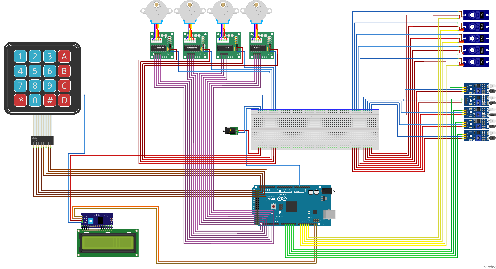

# Distribuino

   
  Projet réalisé par <a href="https://github.com/06Games">Evan Galli</a> et <a href="https://github.com/TeoBaillot">Téo Baillot d'Estivaux</a> dans le cadre du cours d'<b>Électronique avec Arduino</b>

## Documentation

* [Cahier des charges](docs/cahier_des_charges.md)
* [Répartition du travail](docs/repartition_du_travail.md)
* [Rapports de séance et de projet](docs/rapports_de_seance/README.md)

https://github.com/Other-Project/PeiP2-Distribuino/assets/24252743/2bbb648d-e8ed-43b3-9f1b-ac43f1fa2102

