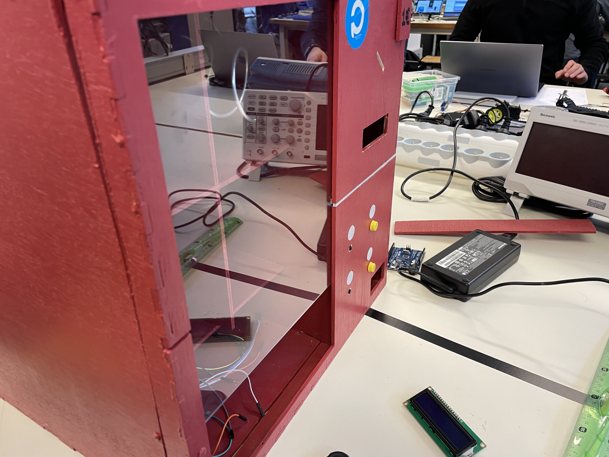
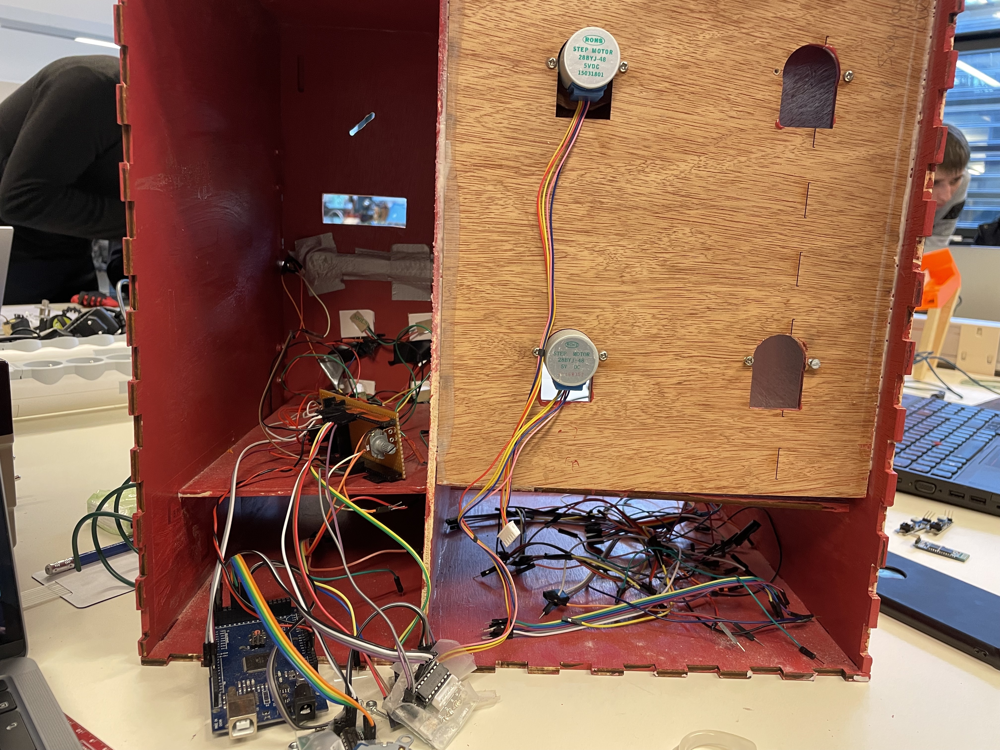
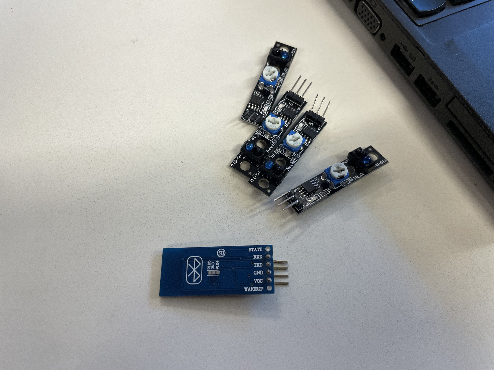
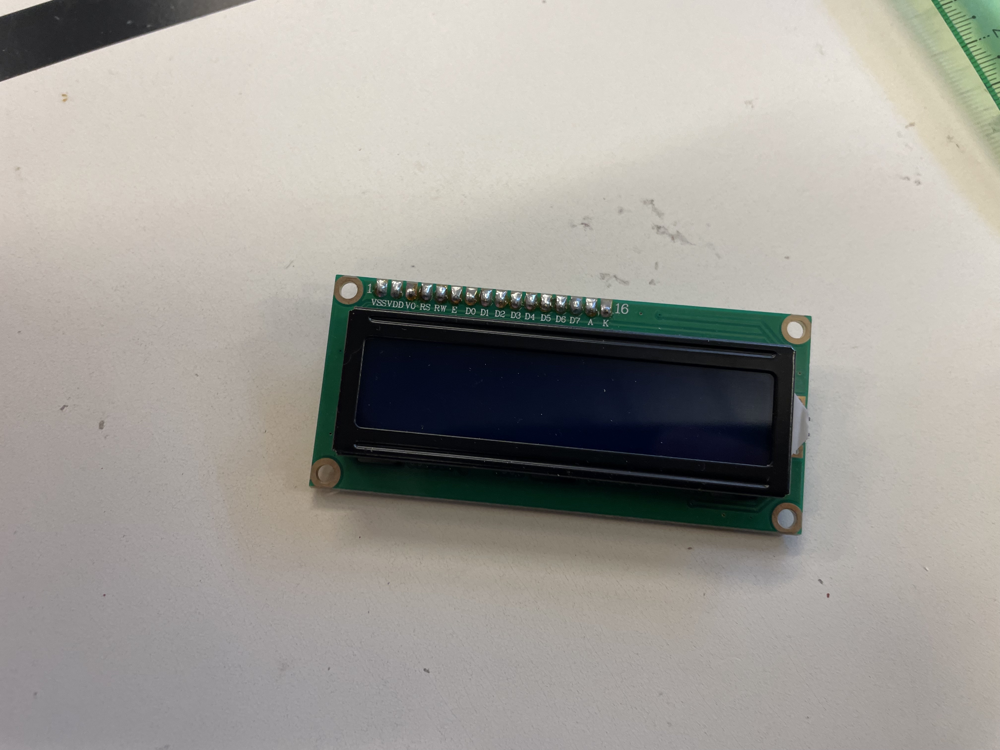
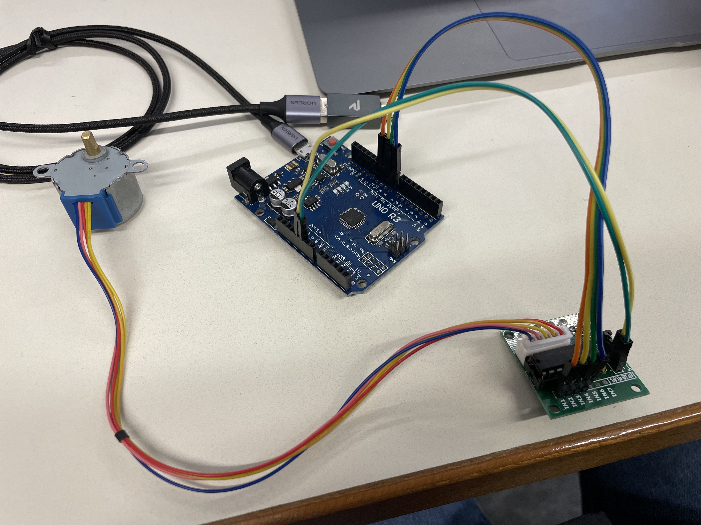
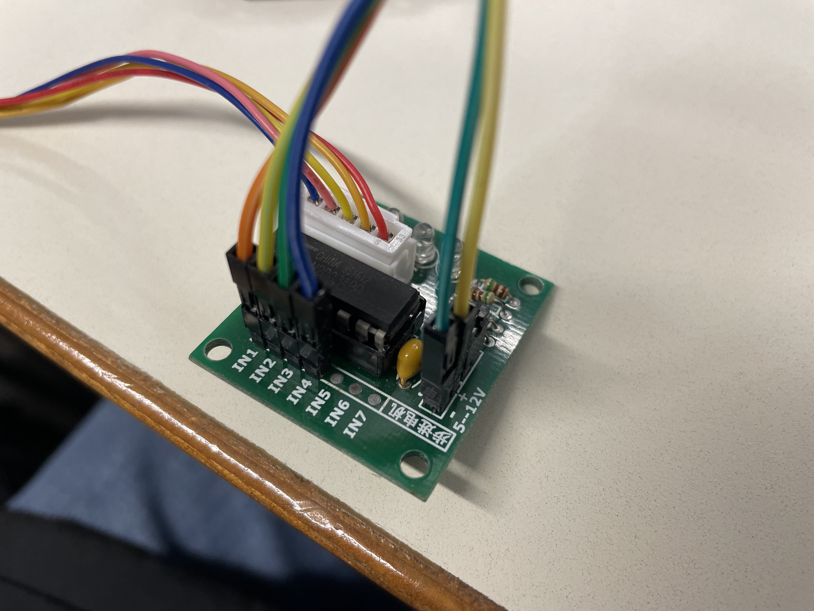

# Evan

## Séance 1 : 14 décembre 2022

### Démontage d'un précédent projet de distributeur automatique
J'ai procédé à la récupération des moteurs pas à pas, du système de tri des pièces et des divers autres composants.  
Lors du démontage, j'ai pris soin d'observer les circuits réalisés par le précédent groupe ainsi que les choix qui avaient été effectués.
Cela a aussi été l'occasion de discuter du fonctionnement du tri des pièces, en observant ce qui a pu être réalisé dans ce projet ainsi que dans celui de la tirelire et du distributeur de billets.







### Tests de fonctionnement des moteurs pas-à-pas
À partir des branchements de l'ancien projet, j'ai pu isoler la partie dédiée au fonctionnement des moteurs pas à pas.  
Celle-ci utilise un `ULN2003APG` pour gérer les contrôles.  
J'ai utilisé la librairie [Stepper](https://docs.arduino.cc/learn/electronics/stepper-motors) pour communiquer avec la puce qui contrôle le moteur pas à pas.  

Exemple de code :

```cpp
#include <Stepper.h>
const int stepsPerRevolution = 2048;
const int rpm = 12;
Stepper stepper1 = Stepper(stepsPerRevolution, 8, 10, 9, 11);

void setup() {
  stepper1.setSpeed(rpm);
}

void loop() {
  stepper1.step(-stepsPerRevolution);
}
```




https://user-images.githubusercontent.com/24252743/207671176-315f9538-9d44-416a-b018-0a31de14a4c6.mp4
